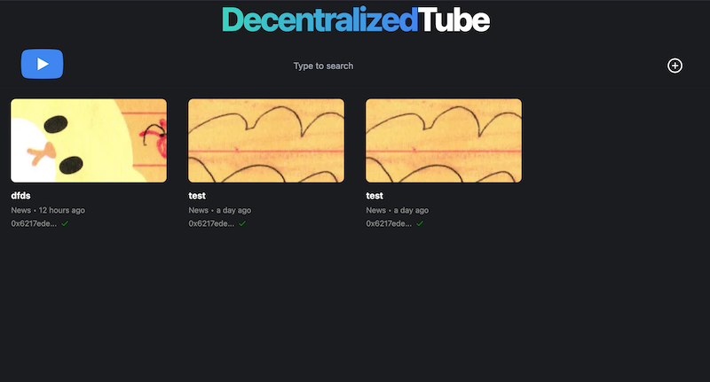
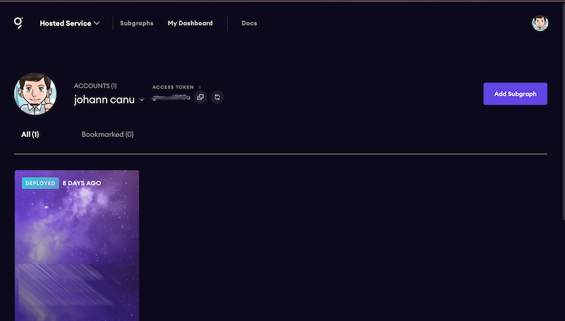
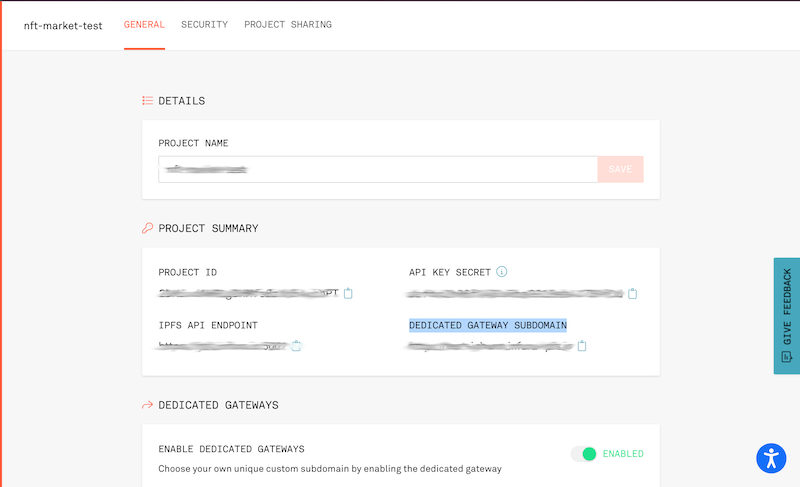
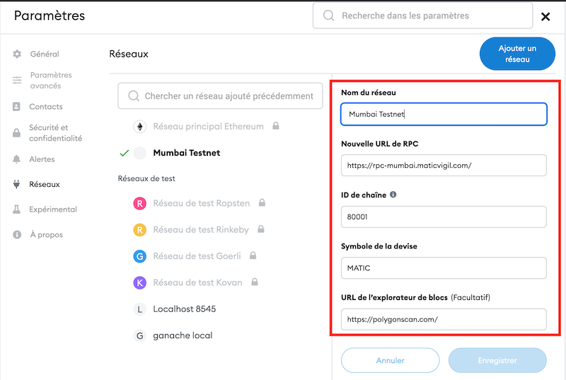
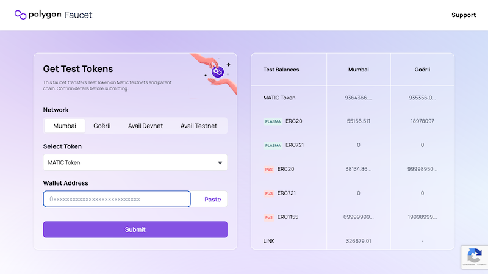

# Decentralized-tube

A fully decentralized videos platform (youtube clone), ready to be deployed on MATIC network. 



## Tech stack

- TheGraph (GraphQL) as indexer
- Apollo client (to connect to theGraph)
- Mumbai (MATIC testnet)
- Next.js
- Tailwind
- plyr-react
- ... and many other

## Before jumping into the code

#### TheGraph account

Instead of querying the blockchain every single time someone will access to the video, we will leverage a blockchain explorer called "theGraph". The first step is to create an account on it from [here](https://thegraph.com/). Then create a "Subgraph".



#### Infura IPFS

Create a account on [Infura](https://infura.io/dashboard), and create a new IPFS project. Don't forget to create a dedicated gateway subdomain in order to reach your documents from internet (from "manage key")



#### Metamask

Install metamask Switch your network to mumbai :

| param              | value                              |
| ------------------ | ---------------------------------- |
| Network Name       | Mumbai Testnet                     |
| New RPC URL        | https://rpc-mumbai.maticvigil.com/ |
| Chain ID           | 80001                              |
| Currency Symbol    | MATIC                              |
| Block Explorer URL | https://polygonscan.com/           |

and get some MATIC token from the official faucet : https://faucet.polygon.technology/




#### Private key

Your wallet private key will be needed to create the contract through hardhat - create a `.env` file that contains your private key:

```
# WARNING ::: NEVER, NEVER USE YOUR REAL WALLET PRIVATE KEY !!!! AND NEVER PUSH THIS FILE TO GITHUB !!!!
touch .env
echo "PRIVATE_KEY='xxx'" > .env
```

And install all the needed package with `npm i`.

## Blockchain side

#### Contract Deployment

Build & deploy are managed by hardhat. Code is already build so you just need to deploy it with the command below :

```
npx hardhat run scripts/deploy.js --network mumbai
>> YouTube deployed to: 0x6fA85CFb3b8714D00Cc2f198826CFEa5003E0Fba
```

> Don't forget to store temporary the contract adress displayed in the console

### TheGraph creation

For the "theGraph" explorer, you will have to rebuild with your own contract address:

```
npm install -g @graphprotocol/graph-cli
graph init
```

> Make sure to input your contract address, name, and ABI.

Then generate the code for your graph and deploy it :

```
cd indexer
yarn codegen
yarn build
yarn deploy
```

## FrontEnd side

It should work out of the box. Just add a `.env.local` with variables below :

```
NEXT_PUBLIC_VIDEO_PLATFORM_CONTRACT_ADRESS="your-contract-address"
NEXT_PUBLIC_SUBGRAPH_URL="your-subgraph-url"

NEXT_PUBLIC_INFURA_IPFS_PROJECT_ID="your-infura-ipfs-project"
NEXT_PUBLIC_INFURA_IPFS_PROJECT_SECRET="your-infura-ipfs-project-secret"

NEXT_PUBLIC_INFURA_IPFS_PRIVATE_GATEWAY="your-private-gateway-url-for-infura-ipfs"
```

> For infura IPFS, Private gateway is now mandatory. And please be careful with the max limit for free-tier !

# Other

This "decentralized video storage" project is inspired from this [article](https://blog.suhailkakar.com/building-a-full-stack-web3-youtube-clone-with-next-ipfs-the-graph-solidity-and-livepeer).
